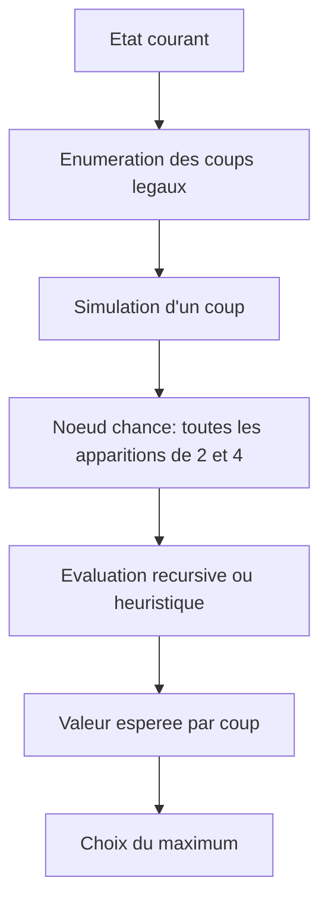

import Project2048ArchitectureDiagram from "../../components/projects/Project2048ArchitectureDiagram.astro";
import Project2048ExpectimaxDiagram from "../../components/projects/Project2048ExpectimaxDiagram.astro";
import Project2048LineExplorer from "../../components/projects/Project2048LineExplorer.astro";
import Project2048Lab from "../../components/projects/Project2048Lab.astro";

## Résumé

Ce projet implémente une version complète de **2048** en Python avec trois dimensions principales :

1. un **moteur de jeu** déterministe pour appliquer les règles du plateau ;
2. une **interface graphique Tkinter** pour le mode joueur et le mode autonome ;
3. une **IA de recherche de type Expectimax** guidée par une **fonction heuristique pondérée**.

L'ensemble s'inscrit dans la famille des agents de jeu classiques fondés sur la recherche arborescente et l'évaluation approximative d'états non terminaux. Le projet ne repose donc pas sur un apprentissage profond, mais sur une combinaison de modélisation explicite, exploration probabiliste, heuristiques stratégiques et tentative d'optimisation automatique des poids.

Ce document reconstruit le fonctionnement du dépôt tel qu'il existe aujourd'hui, en distinguant l'intention algorithmique, l'architecture logicielle, les optimisations, l'interprétation des résultats et les écarts entre les artefacts historiques et l'état actuel du code.

Dépôt git : [AboutJean/2048_python_ai](https://github.com/AboutJean/2048_python_ai)

## Laboratoire interactif

Le composant ci-dessous est un complément au document : il permet de tester
directement un agent 2048 dans le navigateur, de jouer manuellement, d’observer
les recommandations de l’IA et de visualiser la décomposition heuristique.

<Project2048Lab />

---

## 1. Problématique et objectif

Le jeu 2048 est un problème de décision séquentielle en environnement stochastique. À chaque tour, l'agent choisit une action parmi `up`, `down`, `left`, `right`, puis le système ajoute aléatoirement une tuile `2` avec probabilité 0.9 ou `4` avec probabilité 0.1 dans une case vide.

L'objectif implicite de l'agent n'est pas simplement de survivre un coup de plus, mais de maximiser une performance globale : score cumulé, stabilité du plateau, capacité à produire de grandes tuiles et préservation d'une organisation favorable à long terme.

Le projet adopte une stratégie classique en IA symbolique :

- la recherche exhaustive est impossible car l'arbre explose combinatoirement ;
- la recherche est tronquée à profondeur limitée ;
- l'utilité terminale exacte est remplacée par une heuristique de qualité d'état.

---

## 2. Vue d'ensemble de l'architecture

Le dépôt est organisé autour de cinq blocs.

### 2.1. Moteur de jeu

Fichier principal : `game_engine.py`

Responsabilités :

- représenter le plateau 4x4 ;
- appliquer les déplacements et fusions ;
- ajouter les tuiles aléatoires ;
- déterminer la fin de partie ;
- cloner l'état pour la recherche IA.

### 2.2. Interface et orchestration

Fichier principal : `ui.py`

Responsabilités :

- affichage graphique ;
- gestion des entrées clavier ;
- boucle de jeu en mode humain ;
- boucle autonome en mode IA ;
- déclenchement du mode entraînement via CLI.

### 2.3. Évaluation heuristique

Fichier principal : `ai/evaluation.py`

Responsabilités :

- attribuer un score numérique à un plateau non terminal ;
- transformer des critères stratégiques en fonction scalaire ;
- fournir les poids par défaut de l'IA.

### 2.4. Recherche Expectimax

Fichier principal : `ai/search.py`

Responsabilités :

- explorer les coups possibles ;
- modéliser les apparitions aléatoires de tuiles ;
- calculer une valeur espérée ;
- choisir le meilleur mouvement.

### 2.5. Persistance et artefacts expérimentaux

Fichiers : `write_save.py`, `user/user_game.txt`, `user/user_score.txt`, `ai/best_tuned_weights.json`, `tuner_logs.csv`.

Responsabilités : sauvegarder l'état de la partie, conserver le meilleur score, stocker des poids et des traces d'entraînement.

<Project2048ArchitectureDiagram />

---

## 3. Modèle formel du jeu

### 3.1. Espace d'état

Un état est défini par :

$$
s = (G, \sigma)
$$

avec :

- $G \in \mathbb{N}^{4 \times 4}$, la grille ;
- $\sigma \in \mathbb{N}$, le score cumulé.

Chaque case contient soit `0`, soit une puissance de 2.

### 3.2. Transition déterministe contrôlée

Une action $a \in \{\uparrow,\downarrow,\leftarrow,\rightarrow\}$ applique :

1. un compactage des tuiles non nulles ;
2. une fusion locale des tuiles adjacentes identiques ;
3. une mise à jour du score.

### 3.3. Transition aléatoire

Après chaque coup valide, le système tire un événement aléatoire : apparition d'un `2` avec probabilité 0.9 ou d'un `4` avec probabilité 0.1, répartis uniformément parmi les cases vides.

Si $E$ est le nombre de cases vides :

$$
P(2 \text{ dans une case donnée}) = \frac{0.9}{E}, \quad
P(4 \text{ dans une case donnée}) = \frac{0.1}{E}
$$

Cette loi est explicitement codée dans `ai/search.py`.

---

## 4. Mécanique interne du moteur de jeu

### 4.1. Représentation

Le plateau est une liste Python `List[List[int]]` de taille `4x4`.

```python
Grid = List[List[int]]
```

Le score est stocké séparément dans l'objet `Game`.

### 4.2. Initialisation

Quand une nouvelle partie est créée sans grille explicite :

1. le plateau est rempli de zéros ;
2. deux tuiles aléatoires sont ajoutées.

### 4.3. Réduction du problème à un déplacement à gauche

Un choix élégant du projet consiste à **ramener tous les mouvements à un unique opérateur de translation gauche**.

Principe :

- `left` : application directe ;
- `right` : inversion des lignes, translation gauche, puis inversion ;
- `up` : transposition, translation gauche, puis transposition ;
- `down` : transposition + inversion, translation gauche, puis transformation inverse.

Cette idée réduit fortement la duplication de logique et rend le moteur plus fiable. C'est l'une des meilleures décisions de conception du projet.

### 4.4. Fusion et score

La logique de ligne procède ainsi :

1. suppression des zéros ;
2. parcours de gauche à droite ;
3. fusion des paires adjacentes identiques ;
4. incrément du score par la valeur fusionnée ;
5. remplissage par zéros à droite.

Extrait conceptuel :

```python
new_line = [val for val in line_list if val != 0]
...
if new_line[idx] == new_line[idx+1]:
    merged_val = new_line[idx] * 2
    score += merged_val
```

Cette stratégie reproduit correctement la sémantique standard de 2048 : une tuile fusionnée ne refusionne pas immédiatement dans le même coup.

### 4.5. Détection de fin de partie

La partie est terminée si le plateau est plein et qu'aucune fusion horizontale ou verticale n'est encore possible.

<Project2048LineExplorer />

---

## 5. Optimisation centrale du moteur : cache de mouvements pré-calculé

### 5.1. Idée

Le fichier `game_engine.py` construit au chargement un objet `PrecomputedMoveCache`. L'idée est de **pré-calculer le résultat du déplacement gauche pour toutes les lignes plausibles**.

### 5.2. Espace de pré-calcul

Le projet borne l'espace aux valeurs :

$$
\{0, 2, 4, 8, 16, 32, 64, 128, 256, 512, 1024, 2048\}
$$

Soit 12 valeurs par case, donc :

$$
12^4 = 20736
$$

configurations de lignes pré-calculées. Le dépôt confirme ce chiffre à l'exécution :

```text
Move cache built with 20736 entries.
```

### 5.3. Bénéfice algorithmique

Sans cache, chaque déplacement devrait recalculer les fusions ligne par ligne. Avec le cache :

- recherche instantanée du résultat par dictionnaire ;
- coût réduit à un accès mémoire ;
- gain significatif pour la recherche IA, qui appelle `make_move` très souvent.

### 5.4. Limite assumée

Pour des tuiles supérieures à `2048`, le cache ne couvre plus tous les cas et le moteur retombe sur un calcul dynamique. C'est un compromis réaliste.

---

## 6. Interface utilisateur et modes d'exécution

Le projet offre trois modes via `ui.py` : `player`, `ai`, `train`.

### 6.1. Mode joueur

Le joueur utilise les flèches ou `WASD`. Après chaque coup valide :

1. le moteur applique le mouvement ;
2. une tuile aléatoire est ajoutée ;
3. l'état est sauvegardé ;
4. l'interface est rafraîchie.

### 6.2. Mode IA

La boucle autonome suit le cycle :

1. lecture des poids actifs ;
2. appel à `find_best_move_expectimax(...)` ;
3. application du coup choisi ;
4. ajout d'une tuile aléatoire ;
5. sauvegarde ;
6. planification du prochain tour avec `after(100, ...)`.

### 6.3. Persistance

Le projet persiste deux types d'information :

- l'état courant de la partie dans `user/user_game.txt` ;
- le meilleur score et le prochain objectif dans `user/user_score.txt`.

Cette persistance est simple, robuste et très lisible. Elle rend le projet facilement démontrable, car l'état est inspectable sans outil spécialisé.

---

## 7. Cœur de l'IA : recherche Expectimax

### 7.1. Pourquoi Expectimax ?

Dans un jeu déterministe à adversaire rationnel, on utiliserait Minimax. Ici, l'environnement n'est pas malveillant : il est **stochastique**. Il faut donc modéliser les nœuds aléatoires par une **espérance mathématique**.

Le projet utilise donc :

- **nœuds MAX** : l'agent choisit l'action la plus prometteuse ;
- **nœuds CHANCE** : l'algorithme moyenne les états successeurs selon leurs probabilités.

### 7.2. Formule

Pour un nœud de chance :

$$
V(s) = \sum_i p_i \, V(s_i)
$$

Pour un nœud de décision :

$$
V(s) = \max_{a \in A(s)} V(T(s,a))
$$

### 7.3. Décomposition concrète dans le code

Le module sépare clairement :

- `_expectimax_max_node(...)`
- `_expectimax_chance_node(...)`
- `find_best_move_expectimax(...)`



<Project2048ExpectimaxDiagram />

### 7.4. Profondeur de recherche

La profondeur n'est pas fixe. Elle est choisie par `choose_search_depth_rust_like(...)` en fonction du nombre de tuiles distinctes présentes sur le plateau.

Intuition :

- début de partie : plateau simple, profondeur faible ;
- milieu de partie : structure plus complexe, profondeur un peu plus élevée ;
- contrainte pragmatique : Python reste limité en coût de recherche, donc la profondeur est plafonnée à 3.

---

## 8. Fonction heuristique : théorie et lecture

### 8.1. Rôle

Comme la recherche est tronquée, l'algorithme a besoin d'une estimation de la qualité d'un plateau intermédiaire. Cette estimation est donnée par :

$$
H(G) = \sum_k w_k \phi_k(G)
$$

avec $\phi_k$ une caractéristique du plateau et $w_k$ son poids.

### 8.2. Base de score

L'heuristique commence par un terme de base :

```python
board_score = weights.get("lost_penalty", 200000.0)
```

Ce terme agit comme une grande constante de référence à laquelle on ajoute des bonus et retranche des pénalités.

### 8.3. Transformation logarithmique

Les tuiles sont converties en :

$$
r = \log_2(\text{valeur})
$$

Cette décision est mathématiquement pertinente, car les tuiles de 2048 évoluent exponentiellement.

### 8.4. Composantes de l'heuristique actuelle

#### a. Bonus de cases vides

Plus un plateau contient de zéros, plus il reste de liberté combinatoire.

$$
\phi_{\text{empty}}(G) = \#\{(i,j) \mid G_{ij}=0\}
$$

Interprétation : favorise la survie, limite l'enfermement et réduit le risque de saturation.

#### b. Bonus de fusions potentielles

La fonction compte les égalités adjacentes dans une ligne ou une colonne. Une paire identique proche représente une opportunité de compression future.

#### c. Pénalité de non-monotonicité

2048 favorise généralement les plateaux ordonnés, avec un gradient de grandes valeurs concentrées vers un coin. Le code compare les rangs successifs et pénalise les inversions. Il prend le minimum entre les pénalités gauche-droite et droite-gauche, ce qui revient à favoriser une forme monotone dans un sens ou dans l'autre.

$$
\phi_{\text{mono}}(G) = - \min(P_{\leftarrow}(G), P_{\rightarrow}(G))
$$

#### d. Pénalité sur la somme des puissances

Le terme

$$
\sum r_i^{p}
$$

est pénalisé via `sum_penalty_weight`. L'idée est qu'un plateau très chargé en rangs élevés mais mal structuré devient coûteux.

#### e. Bonus de grande tuile dans un coin cible

Le coin cible retenu est le coin **supérieur droit**. Si la plus grande tuile s'y trouve, le score reçoit un bonus proportionnel à :

$$
\log_2(\text{max tile})
$$

pondéré par `max_tile_in_corner_bonus`.

#### f. Récompense des fusions réellement obtenues

Le terme `actual_merges_score_weight` ajoute une trace immédiate du gain du dernier coup. Il ne s'agit plus d'une promesse structurelle, mais d'une récompense locale pour les merges effectifs.

### 8.5. Lecture stratégique de l'heuristique

En pratique, l'heuristique encode une philosophie du jeu : garder de l'espace, préparer des fusions, éviter les inversions chaotiques, maintenir un gradient ordonné, ancrer la plus grande tuile dans un coin et valoriser les coups qui génèrent de vraies fusions.

---

## 9. Mémoïsation, symétries et réduction d'espace de recherche

### 9.1. Table de transposition

Le module `ai/search.py` utilise un cache global de la forme :

```python
expectimax_cache: Dict[(canonical_grid, depth, node_type), float]
```

L'idée est de mémoriser la valeur déjà calculée d'un état pour éviter des recomputations coûteuses.

### 9.2. Canonicalisation par symétries

Le point le plus intéressant est que la clé du cache ne repose pas sur le plateau brut, mais sur une version **canonique** calculée dans `ai/utils.py`.

La fonction :

1. génère les 4 rotations ;
2. ajoute pour chacune une réflexion horizontale ;
3. convertit chaque version en tuple immuable ;
4. garde la plus petite lexicographiquement.

Cela quotient l'espace des états par le groupe diédral d'ordre 8 des symétries du carré.

En termes mathématiques, deux plateaux symétriques sont traités comme équivalents pour le cache. C'est une excellente idée : réduction des doublons, meilleure densité de la mémoïsation et optimisation conceptuellement élégante.

---

## 10. Autres optimisations présentes

### 10.1. Ordonnancement heuristique des coups

Avant l'exploration complète, les coups sont triés selon une évaluation heuristique rapide. Même si Expectimax ne pratique pas ici un alpha-beta strict, cet ordonnancement reste utile : meilleure utilisation du cache, premières bonnes valeurs plus tôt, comportement plus stable.

### 10.2. Seuil de probabilité cumulative

Les nœuds de chance utilisent un seuil `EXPECTIMAX_CPROB_THRESHOLD_BASE`. Si une branche a une probabilité cumulative trop faible, son impact sur l'espérance devient négligeable et elle peut être ignorée.

### 10.3. Clonage d'état simple et sûr

Le moteur clone explicitement la grille avant simulation. Ce n'est pas la stratégie la plus compacte, mais elle est robuste et réduit les bugs liés aux alias de listes Python.

---

## 11. Processus de pensée derrière la conception

Le projet révèle une chaîne de raisonnement cohérente :

### 11.1. Séparer la logique du jeu et la logique de décision

La première étape consiste à construire un moteur exact et testable. L'IA ne modifie jamais directement les règles ; elle ne fait qu'interroger le moteur via des clones.

### 11.2. Ramener la complexité à des primitives simples

Deux exemples remarquables :

- tous les mouvements sont ramenés à un déplacement gauche ;
- plusieurs plateaux sont ramenés à une forme canonique unique.

Dans les deux cas, le projet réduit un problème riche à une primitive stable.

### 11.3. Substituer l'optimalité impossible par une estimation informative

Le projet reconnaît qu'une recherche exhaustive est hors de portée et introduit une heuristique riche, inspirée de bonnes pratiques connues sur 2048 : vide, monotonicité, opportunités de fusion, coin dominant, récompense locale.

### 11.4. Introduire un réglage automatique des poids

Au lieu de figer tous les coefficients à la main, le projet cherche à les ajuster empiriquement. Cela montre une transition intéressante entre IA à connaissances codées à la main et optimisation empirique des hyperparamètres.

---

## 12. Entraînement et ajustement des poids

### 12.1. Intention générale

Le fichier `ai/trainer.py` met en place un processus proche d'un **algorithme évolutionnaire** : partir d'un vecteur de poids de base, générer plusieurs variantes aléatoires, jouer plusieurs parties par variante, mesurer un score moyen, conserver les meilleurs paramètres et muter à nouveau autour du meilleur candidat.

Cette approche ne fait pas d'apprentissage par gradient ; elle relève plutôt de la recherche stochastique dans l'espace des hyperparamètres.

### 12.2. Traces disponibles

Le fichier `tuner_logs.csv` contient des générations successives et des scores moyens associés à des jeux de poids. On y observe une montée jusqu'à des scores moyens d'environ `26727.2` pour certaines configurations.

### 12.3. Point critique : incohérence historique des poids

L'état actuel du dépôt présente une divergence importante :

- l'heuristique actuelle attend des clés comme `empty_weight`, `merges_weight`, `sum_power`, `max_tile_in_corner_bonus` ;
- `best_tuned_weights.json` contient des clés d'une **ancienne génération heuristique** comme `empty_cells`, `smoothness`, `corner_gradient`, `score_from_merges`.

Conséquence directe :

- `get_active_ai_weights()` lit bien le JSON ;
- mais comme les clés ne correspondent pas à celles attendues par l'heuristique actuelle, **aucun de ces poids historiques n'écrase réellement les poids par défaut** ;
- l'IA actuelle joue donc avec les poids par défaut de `ai/evaluation.py`, malgré le message indiquant un chargement réussi.

Autrement dit, `best_tuned_weights.json` et `tuner_logs.csv` documentent une **phase antérieure du projet**, pas exactement le comportement du moteur actuel.

### 12.4. Point critique : pipeline d'entraînement incomplet

L'analyse exécutable du dépôt montre aussi que le mode `train` échoue actuellement avec :

```text
NameError: name 'generate_candidate_weights_from_base' is not defined
```

Le fichier `ai/trainer.py` référence plusieurs fonctions absentes, ce qui indique un refactoring interrompu ou une migration incomplète entre deux versions de l'heuristique.

---

## 13. Comment lire les résultats

### 13.1. Résultats de jeu

#### `user/user_game.txt`

Format :

1. score courant ;
2. quatre lignes représentant la grille.

Exemple observé dans le dépôt :

```text
4656
8 2 4 512
16 32 16 8
8 16 8 4
2 64 4 2
```

Lecture : score courant `4656`, plateau presque saturé, plus grande tuile `512`, état proche de l'échec car peu d'espace libre.

#### `user/user_score.txt`

Format : meilleur score historique et prochain objectif de tuile.

Exemple observé :

```text
# high score
78872

# next tile goal
8192
```

Lecture : le projet a déjà atteint un niveau de jeu élevé et l'objectif suivant est `8192`, ce qui suggère que des runs antérieurs ont dépassé 4096.

### 13.2. Résultats de tuning

`tuner_logs.csv` se lit comme un journal expérimental :

- `generation` : itération évolutionnaire ;
- `set_index` : candidat dans la génération ;
- `avg_score` : score moyen sur plusieurs parties ;
- colonnes `weight_*` : paramètres testés.

Attention cependant : les colonnes du CSV appartiennent à une ancienne famille de features. Elles restent utiles pour raconter l'histoire du projet, mais pas pour décrire exactement l'heuristique actuelle.

---

## 14. Forces du projet

### 14.1. Très bonne séparation conceptuelle

Moteur, UI, IA, persistance et tuning sont nettement distincts.

### 14.2. Bon niveau de pensée algorithmique

Les idées suivantes sont particulièrement solides :

- réduction des mouvements à un cas canonique ;
- cache pré-calculé sur les lignes ;
- cache Expectimax avec table de transposition ;
- quotient par symétries de la grille ;
- profondeur adaptative.

### 14.3. Projet pédagogiquement riche

Le dépôt mobilise plusieurs notions majeures en informatique : structures de données, programmation orientée objet légère, programmation événementielle Tkinter, théorie des jeux stochastiques, espérance mathématique, heuristiques d'évaluation, optimisation de performance et recherche locale / évolutionnaire.

### 14.4. Bon compromis entre sophistication et lisibilité

L'algorithme est assez avancé pour être intéressant, mais reste suffisamment explicite pour être présenté sur un site personnel de manière pédagogique.

---

## 15. Limites et points d'attention

### 15.1. Dépendance à une heuristique codée à la main

L'agent n'apprend pas une représentation abstraite du jeu ; sa qualité dépend beaucoup du bon choix des features et des poids.

### 15.2. Profondeur limitée

La profondeur 2-3 reste modeste. Cela suffit pour un agent rapide, mais ne capture pas toutes les conséquences à long terme.

### 15.3. État du code expérimental

Le projet contient des traces de plusieurs générations de conception : ancienne heuristique, nouvelle heuristique inspirée d'un moteur Rust, pipeline de tuning inachevé. Pour une présentation sérieuse, il faut assumer cet aspect comme une **évolution de prototype**.

### 15.4. Charge CPU initiale

Le cache des lignes est construit au chargement du module. C'est acceptable, mais implique un coût de démarrage.

---

## 16. Interprétation scientifique du projet

Ce projet illustre bien un paradigme important de l'IA classique : quand l'exploration exhaustive est impossible, on combine recherche partielle, modélisation probabiliste et heuristique structurée.

Sur le plan scientifique, il convoque simultanément :

- **algorithmique** : réduction de problèmes, caches, symétries ;
- **probabilités** : loi d'apparition des tuiles et espérance ;
- **mathématiques discrètes** : grilles, transformations, invariants ;
- **optimisation** : sélection de paramètres ;
- **ingénierie logicielle** : modularité, persistance, interface.

Il constitue donc un bon exemple de projet où l'intelligence du système provient moins d'un gros modèle appris que d'une **mise en forme rigoureuse du problème**.

---

## 17. Conclusion

Dans sa structure profonde, ce projet a été pensé comme un moteur de 2048 auquel on ajoute progressivement des couches d'intelligence :

1. d'abord la règle exacte ;
2. puis l'automatisation du jeu ;
3. ensuite la recherche probabiliste ;
4. enfin l'ajustement empirique des heuristiques.

Ses meilleures idées sont :

- la normalisation des mouvements ;
- le cache de lignes ;
- la canonicalisation par symétries ;
- l'usage d'Expectimax plutôt que Minimax ;
- l'encodage explicite d'une stratégie spatiale de plateau.

Pour une présentation de site, le projet peut être présenté comme :

- un **moteur de jeu algorithmique** ;
- un **agent d'IA heuristique et probabiliste** ;
- un **prototype expérimental de tuning automatique** ;
- un exemple concret de dialogue entre mathématiques, stratégie et performance logicielle.

---

## 18. Annexe : commande d'exécution

Mode joueur :

```bash
python ui.py -m player
```

Mode IA :

```bash
python ui.py -m ai
```

Mode entraînement :

```bash
python ui.py -m train
```

Note importante : dans l'état actuel du dépôt, le mode `train` ne s'exécute pas complètement à cause de fonctions manquantes dans `ai/trainer.py`.
