## Promesse technoscientifique, Loi de Moore et GPU

### Promesse technoscientifique

Les promesses technoscientifiques, un phénomène relativement ancien, servent de fonction idéologique en
établissant un lien entre la science et le progrès. Elles jouent un
rôle crucial dans l'orientation de la recherche et influencent la
perception de la société envers les avancées technologiques. Par
exemple, le développement du télescope électrique de Paul Otlet a été présenté
comme une promesse de progrès scientifique.

Ces promesses remplissent trois critères principaux :

- Elles sont optimistes
- Imposent des solutions technologiques
- Et déterminent les moyens alloués à la recherche

Deux contraintes :

- Les **contraintes de nécessité** définissent un problème
  émergent et imposent une nouveauté radicale, présentant le faiseur
  de promesse comme le point de passage obligé pour résoudre le
  problème. Cela peut être néfaste car cela masque d'autres options
  potentielles.
- Les **contraintes de crédibilité** requièrent le
  soutien de spécialistes, même si leurs arguments sont trompeurs,
  pour convaincre le public. Cela peut être néfaste car cela
  instaure une vision irréaliste de la réalité.

Les promesses diviennent dangereuse à partir du moment où elle ne
participe plus seulement à la création de vision et à la stimulation de
l'imagination mais qu'elle contribuent à promouvoir des discours irréalistes.

### Loi de Moore

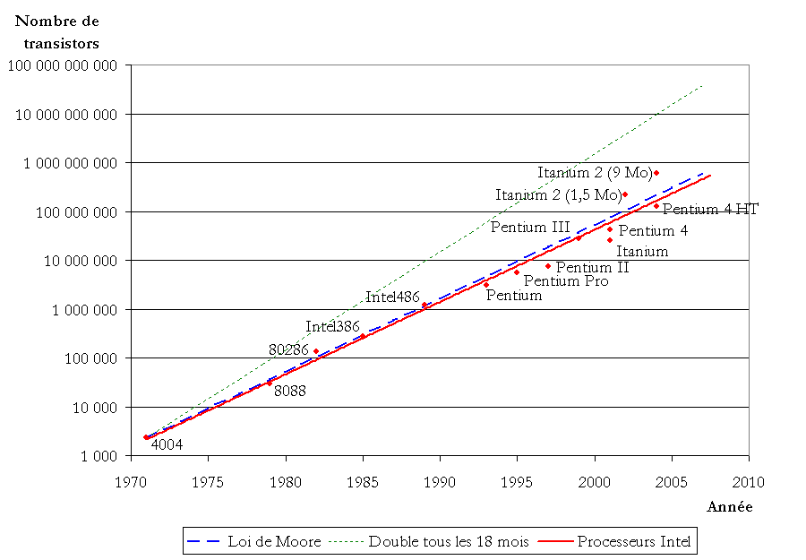

La **loi de Moore** stipule que la densité des transistors
double tous les 18 mois. Il existe différentes versions de cette loi,
avec des périodes de 12 à 24 mois, ainsi qu'une variante concernant
la vitesse des processeurs. Cette loi est devenue un modèle pour la
fabrication de promesses technoscientifiques.

Dans les années 1950, Fairchild Semiconductor a lancé des recherches
sur les transistors pour l'armée, visant à développer un processus
planaire pour fabriquer des transistors à partir de couches de
silicium et à intégrer plusieurs transistors dans un seul dispositif.

Le succès de ces recherches a imposé un nouveau
**modèle d'affaire** : cibler le marché civil et créer une
demande. Cependant, en raison des coûts élevés, la demande était
insuffisante. Pour y remédier, Moore a publié un manifeste
économique sous forme de promesse.

Il est important de noter que la loi de Moore
**n'est pas un modèle économique**
mais une tendance technique, que le coût moyen par composant a
**disparu**
et que les progrès techniques entraînent une réduction des coûts
de production, et non l'inverse.

En **2024**, le coût se déconnecte des réalités socio-économiques
pour trois raisons principales :

1. Le coût des ressources et de l'énergie
2. Le coût de production des sites de fabrication, avec des
   délocalisations successives vers des pays offrant des politiques
   fiscales avantageuses
3. Le changement des habitudes de consommation, les consommateurs
   conservant les appareils qui fonctionnent déjà suffisamment bien

### GPU et CPU

#### CPU (Central Processing Unit)

Le CPU est le "cerveau" de l'ordinateur, qui exécute la plupart
des calculs généraux et contrôle les autres composants.
Il est optimisé pour le traitement séquentiel des tâches, en
exécutant des instructions complexes une par une.
Les CPU modernes ont généralement entre 2 et 16 cœurs, ce qui
leur permet d'exécuter plusieurs tâches simultanément.
Ils sont polyvalents et peuvent gérer une grande variété de
tâches, des plus simples aux plus complexes.

**Caractéristiques des CPU :**

- Moins de cœurs
- Faible latence
- Traitement en série
- Quelques opérations en même temps

#### GPU (Graphics Processing Unit)

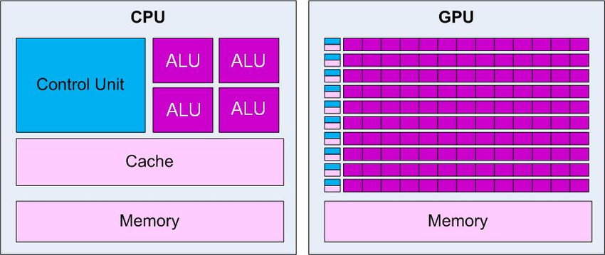

Le GPU est un processeur spécialisé, initialement conçu pour
accélérer le rendu des graphiques 2D et 3D.
Contrairement au CPU, le GPU est optimisé pour le traitement
parallèle, capable d'exécuter de nombreuses tâches simples
simultanément.
Les GPU modernes peuvent avoir des milliers de cœurs, ce qui les
rend très efficaces pour les tâches qui peuvent être divisées en
petits morceaux et traitées en parallèle.
Bien que conçus à l'origine pour les graphiques, les GPU sont
désormais utilisés pour accélérer divers types de calculs, tels que
l'apprentissage automatique, le traitement du signal et la
simulation physique.

**Caractéristiques des GPU :**

- Beaucoup de cœurs (2000 à 50 000)
- Haute latence
- Traitement en parallèle
- Beaucoup d'opérations en même temps

**Applications des GPU :**
Jeux vidéo, Traitement d'images 3D, Accélération des calculs,
Calculs de matrices, Réseaux de neurones (apprentissage automatique).

La **loi de Huang** prévoit un doublement des performances des
GPU tous les deux ans. Cependant, les performances ne dépendent pas
uniquement de la physique des composants, mais aussi de la précision
des calculs. Par exemple, le passage de 64 à 16 bits dans Ariane 5
en 1996 a entraîné une erreur de calcul.

Google développe une nouvelle représentation des nombres à virgule
flottante : les **Brain Floats**, conçus spécialement pour les
réseaux de neurones et l'apprentissage automatique. Ils améliorent
la précision des calculs tout en maintenant une efficacité en termes
de mémoire et de performance pour plusieurs raisons :

- Ils utilisent une **représentation plus adaptée** :
  ils allouent plus de bits à la partie fractionnaire (mantisse)
  du nombre.
- Ils ont une **plage dynamique plus étendue**, ce qui
  signifie qu'ils peuvent représenter un plus grand éventail de valeurs.
- Ils permettent une **réduction des erreurs d'arrondi**.
- Ils offrent une **meilleure efficacité de stockage et
  de calcul** : ils utilisent moins de bits que les formats à double
  précision, ce qui permet de réduire l'empreinte mémoire et
  d'accélérer les calculs sur les processeurs spécialisés (GPU).

Le matériel informatique s'adapte ainsi aux besoins de l'IA avec, par
exemple :

- **NVIDIA H100** : GPU basé sur l'architecture Hopper,
  supportant le format bfloat16.
- **Google TPU** (Tensor Processing Unit) : ASIC conçu pour
  accélérer les charges de travail d'IA, optimisé pour les tenseurs,
  offrant une meilleure efficacité énergétique que les GPU.
- **Groq TSP** (Tensor Streaming Processor) : processeur spécialisé
  pour l'IA, doté d'une architecture de flux de données unique,
  offrant une latence plus faible et un débit plus élevé que les
  GPU et TPU.
- **Apple Neural Engine** : intégré dans les puces de la
  série M, optimisé pour les appareils Apple, offrant une
  meilleure efficacité énergétique.
- **AWS Trainium** : ASIC optimisé pour l'inférence de
  modèles d'apprentissage dans le cloud, offrant de meilleures
  performances par watt que les GPU pour l'inférence d'IA.

La course aux performances des GPU, illustrée par les records battus
par Nvidia et les fluctuations boursières associées, s'accompagne de
tensions géopolitiques.

Une **nouvelle loi de Moore**, prévoyant une multiplication par dix
de la puissance de calcul, pourrait émerger.

#### Créer un modèle de langage moderne

1. **Collecte de données :** Rassembler d'importantes quantités
   de données textuelles de haute qualité et diversifiées (ChatGPT-4 :
   45 To de données textuelles).
2. **Prétraitement des données :** Nettoyer les données,
   effectuer la tokenisation (diviser en plus petites unités :
   mots, sous-mots, caractères) et l'encodage (convertir les tokens
   en représentations numériques).
3. **Conception de l'architecture :** Déterminer le nombre
   de couches, de têtes d'attention et de neurones. Utiliser un
   grand nombre de paramètres (ChatGPT-4 : 1800 milliards de
   paramètres).
4. **Entraînement :** Alimenter le modèle avec les données
   prétraitées et ajuster les paramètres par *rétropropagation*.
   L'entraînement nécessite une puissance de calcul élevée (ChatGPT-4 :
   1,5 exaflops).
5. **Ajustement et optimisation :** Affiner les
   hyperparamètres du modèle, appliquer des techniques de
   régularisation et utiliser des méthodes telles que
   l'apprentissage par transfert ou l'affinage pour adapter le
   modèle à des tâches spécifiques.
6. **Évaluation et déploiement :** Évaluer les performances du
   modèle sur des ensembles de données de test, mesurer des métriques
   telles que la perplexité, le BLEU ou le ROUGE, et déployer le modèle
   entraîné pour des applications pratiques.

L'impact environnemental de cette course à la puissance de calcul et
l'épuisement des ressources en données soulèvent des questions
importantes. De plus, le développement rapide de l'IA et des modèles
de langage soulève des enjeux éthiques et sociétaux qui méritent une
réflexion approfondie.

---

## Les Hivers et Booms de l'IA : Traitement d'Images

*Il est important de noter que les informations ci-présentes sont
centrées sur les États-Unis, genrées et ethno-centrées ainsi que parcellaires.*

### Préambule

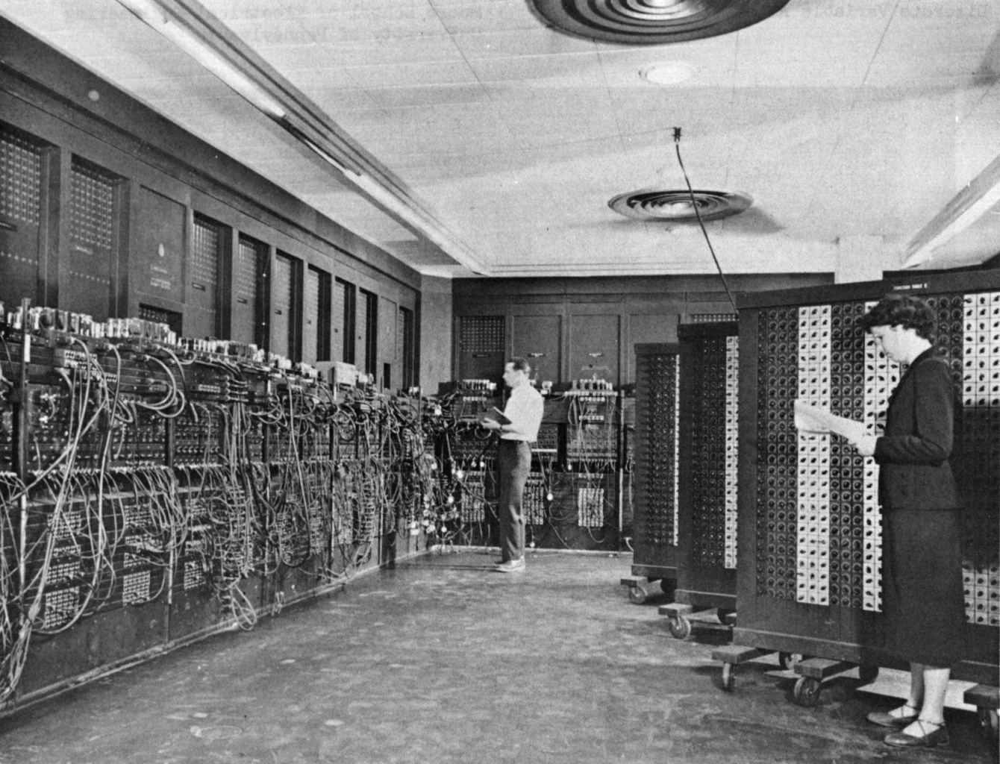

Les dispositifs de calcul existent depuis des milliers d'années
et sont devenus mécaniques.

La Seconde Guerre mondiale a entraîné une demande accrue en calcul : guerre moderne, cryptage,
ENIAC (calcul balistique).

Les calculs balistiques, initialement effectués avec des tables, manquaient
d'efficacité, ce qui a conduit à la création de l'ENIAC (considéré comme le "premier
ordinateur"). Cependant, il présentait un problème
d'architecture : il nécessitait d'écrire manuellement toutes
les sous-opérations. En réponse, Von Neumann (1945) a développé l'EDVAC,
instaurant le concept de **programme enregistré** et
utilisant des analogies avec le cerveau.

Les ordinateurs sont sortis des laboratoires : en 1946, Eckert et Mauchly ont quitté l'université et fondé
EMCC. En 1949, ils ont conçu et vendu le premier ordinateur, le BINAC (qui servira
de référence à l'UNIVAC), se tournant vers l'industrie avec
l'UNIVAC (pour des applications industrielles et administratives), ainsi que dans la culture.

En 1956, le terme "intelligence artificielle" est apparu pour la première fois.
On parlait de machines pensantes, de cerveaux électroniques, et un programme de
recherche a été lancé.

#### Glossaire des premières machines

**ENIAC** (Electronic Numerical Integrator and Computer) —
Premier ordinateur numérique électronique à usage général, développé en 1945.
Utilisé pour calculer des trajectoires balistiques pendant la Seconde Guerre mondiale.
Programmé manuellement en connectant des câbles et en configurant des interrupteurs.

**EDVAC** (Electronic Discrete Variable Automatic Computer) —
Successeur de l'ENIAC, conçu par John von Neumann en 1945.
Introduit le concept de programme enregistré, où les instructions et les données sont stockées dans la même mémoire.
A servi de base à l'architecture de von Neumann, utilisée dans la plupart des ordinateurs modernes.

**EMCC** (Eckert-Mauchly Computer Corporation) —
Entreprise fondée en 1946 par J. Presper Eckert et John Mauchly, les concepteurs de l'ENIAC.
Première entreprise à commercialiser des ordinateurs à usage général.

**BINAC** (Binary Automatic Computer) —
Ordinateur développé par EMCC en 1949.
Premier ordinateur commercial à utiliser l'arithmétique binaire et le stockage sur bande magnétique.

**UNIVAC** (UNIVersal Automatic Computer) —
Premier ordinateur commercial produit par EMCC (rachetée par Remington Rand).
Utilisé pour le recensement américain de 1950 et la prévision des résultats des élections présidentielles de 1952.

**ELIZA** —
Programme informatique développé par Joseph Weizenbaum au MIT en 1964-1966.
Simulait une conversation avec un psychothérapeute en utilisant des techniques de traitement du langage naturel.
Considéré comme l'un des premiers chatbots et un exemple précoce d'IA dans le traitement du langage naturel.

### 1960 : Premier Boom de l'IA 'symbolique'

Le MIT, Stanford et Carnegie Mellon ont reçu des financements
pour la recherche en IA.

L'IA s'est également développée dans la culture (2001, l'Odyssée de l'espace).

### 1965–1975 : Premier Hiver de l'IA

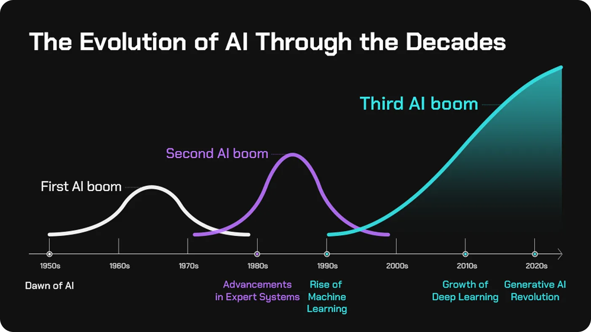

Les promesses n'ont pas été tenues, entraînant une diminution
des financements.

Les promoteurs ont également été accusés de ne se concentrer que sur
des modèles "jouets" (ludiques, simples, théoriques).

Sortie du livre de Dreyfus : "What computers can't do" (1972).

### 1975–1985 : Systèmes experts et 2e Boom

Les ordinateurs sont devenus plus puissants, l'accent a été mis sur les connaissances spécialisées "expertes",
et les processus de raisonnement ont été décomposés en briques élémentaires.

**Système expert :** est un programme informatique conçu pour résoudre
ou prendre des décisions dans un domaine spécifique, en imitant le raisonnement
d'un expert humain. Il est composé de trois éléments :

- Une base de connaissances contenant les informations, faits, règles spécifiques
  au domaine, fournis par les experts.
- Un moteur d'inférence (le cerveau) qui utilise les informations
  pour en tirer des conclusions.
- Une interface utilisateur, qui permet à un non-expert d'interagir
  avec le système.

Par exemple : MYCIN posait une série de questions aux médecins, utilisait 600 règles et produisait une
liste de bactéries candidates ainsi que des propositions de traitement.

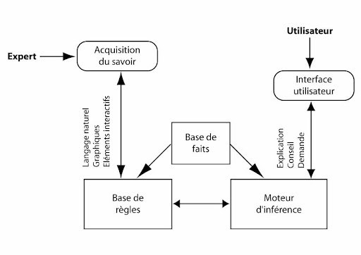

D'autres projets ont été lancés et une industrie a redémarré. Cependant, les systèmes experts avaient une limite : l'insertion
des données manuelles était très coûteuse et fastidieuse.

### 1985–2005 : Deuxième hiver et travail de l'ombre

**Promesses non tenues :** problèmes de matériel informatique, maintenance,
faillite de startups.

**Parallel Distributed Processing (PDP) :** est une approche de l'IA
basée sur les réseaux de neurones artificiels, les informations sont traitées en parallèle
et c'est un modèle capable d'apprendre à partir d'exemples et de généraliser à de nouvelles
situations.

**Rétropropagation du gradient :** est un algorithme d'apprentissage
qui ajuste les poids des connexions entre les neurones en fonction de l'erreur
de sortie en propageant l'erreur en arrière pour permettre d'ajuster les poids,
ce qui permet au réseau d'apprendre à partir d'exemples étiquetés.

**LeNet** est une architecture de réseaux convolutifs développée dans
les années 90, conçue pour la reconnaissance de caractères manuscrits.
LeNet-1, développé en 90 pour reconnaître les codes postaux, est suivi de
LeNet-5 pour reconnaître les chiffres manuscrits.

Cette technologie introduit les concepts de couches de convolution,
de sous-échantillonnage (pooling) et de couches entièrement connectées.

### 2005–2024 : Réseaux de neurones profonds et 3e Boom

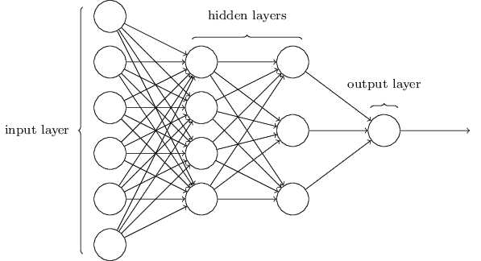

**Le Deep Learning :** est une branche de l'IA basée sur les
réseaux de neurones artificiels multicouches, il utilise des architectures complexes, appelées
réseaux de neurones profonds, pour apprendre des
représentations hiérarchiques des données.

- **Architectures profondes :** les réseaux comportent de nombreuses
  couches cachées, permettant l'apprentissage de caractéristiques
  de plus en plus abstraites.
- **Apprentissage automatique des caractéristiques :**
  contrairement aux approches traditionnelles, le Deep Learning ne
  nécessite pas d'ingénierie manuelle des caractéristiques.
- **Grande quantité de données :** les réseaux profonds nécessitent
  d'importants volumes de données pour obtenir de bonnes performances.
- **Puissance de calcul :** l'entraînement des réseaux profonds
  requiert une puissance de calcul élevée, souvent fournie par
  des GPU.

La numérisation et l'essor d'Internet font exploser la
quantité de données disponibles.

#### Fonctionnement des réseaux de neurones convolutifs

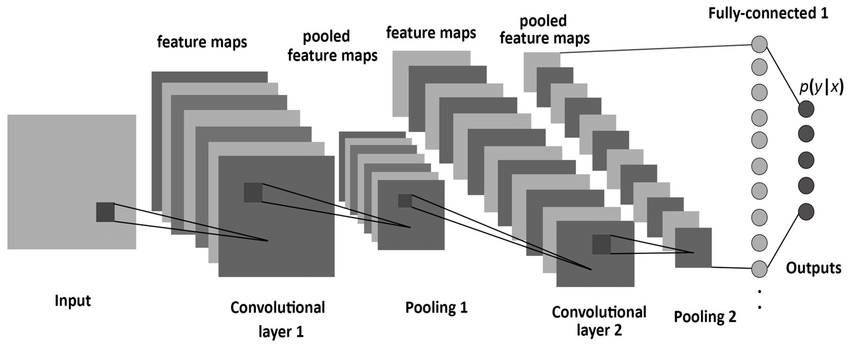

- **Image en entrée :** encodage (RGB ou niveaux de gris), résolution de l'image
  qui varie selon l'architecture (AlexNet 224x224 vs LeNet 32x32), représentée comme une matrice de pixels.
- **Couche de convolution :** des filtres (noyaux) parcourent l'image
  pour extraire des caractéristiques locales. Chaque filtre est conçu pour
  détecter des caractéristiques (motifs) spécifiques. L'opération entre les filtres
  et les régions locales de l'image produit des cartes d'activation.
- **Carte d'activation :** résulte de l'application d'une fonction
  d'activation (ReLU), ajoute de la non-linéarité au modèle permettant l'apprentissage
  de relations plus complexes.
- **Couche de correction :** stabilise l'apprentissage
  en normalisant la sortie des couches précédentes, accélère la convergence du modèle
  et réduit la sensibilité aux changements d'échelle d'entrée.
- **Couche de mise en commun (pooling) :** réduit la dimensionnalité
  spatiale pour réduire le nombre de paramètres de calcul et extraire les caractéristiques
  les plus pertinentes. Elle utilise différentes opérations comme le Max Pooling (maximum)
  ou l'Average Pooling (moyenne) dans une fenêtre glissante.
- **Couche entièrement connectée (fully-connected) :** intervient après plusieurs
  couches de convolution et de pooling. Les caractéristiques apprises sont aplanies en un vecteur
  et passent à travers une ou plusieurs couches fully-connected pour la classification finale.
  La dernière couche fully-connected a souvent un nombre de neurones
  correspondant au nombre de classes à prédire.
  Une fonction d'activation est appliquée à la sortie pour obtenir une probabilité de classe.

#### Comparaison : AlexNet, ResNet et LeNet

| | **AlexNet** | **ResNet** | **LeNet** |
|:---|:---:|:---:|:---:|
| **Année** | 2012 | 2015 | 1998 |
| **Couches** | 8 | 152 | 7 |
| **Paramètres** | 60 millions | 60 millions | 60 000 |
| **Taille d'entrée** | 224 × 224 | 224 × 224 | 32 × 32 |
| **Tâche** | Reconnaissance d'objets | Reconnaissance d'objets | Reconnaissance de caractères |
| **Jeu de données** | ImageNet | ImageNet | MNIST |
| **Architecture** | Convolutions, pooling, couches FC | Convolutions, pooling, modules résiduels, couches FC | Convolutions, pooling, couches FC |
| **Innovations** | ReLU, augmentation des données, dropout | Connexions résiduelles pour faciliter l'entraînement profond | Première architecture convolutive pour caractères manuscrits |

---

## Hivers et Booms de l'IA : Traduction automatique

### 1950–1965 : Genèse — mémorandum de Warren Weaver et premières démonstrations

Warren Weaver a écrit un mémorandum intitulé "Translation" où il propose
d'utiliser les ordinateurs pour traduire des textes.
Il utilise des techniques statistiques et cryptographiques pour réaliser
des traductions.

En 1954, IBM et l'Université de Georgetown font la première démonstration publique d'un système qui traduit plus de 60 phrases du russe vers l'anglais.
Même si les phrases et le vocabulaire étaient choisis, cela a suscité beaucoup
d'intérêt.

La même année, la revue "Machine Translation" est lancée, consacrée
spécifiquement à la traduction automatique.
Elle contribue à établir la traduction comme un domaine de recherche à
part entière et permet aux chercheurs de partager leurs travaux.

### 1965–1990 : Crise, le rapport ALPAC et conséquences

Le rapport de l'ALPAC a été commandé par le gouvernement américain pour
évaluer les progrès de la traduction automatique.

Sa conclusion : la traduction automatique est plus lente, moins précise et plus chère que la traduction humaine.
Ils voulaient donc retirer les financements car les progrès étaient jugés insuffisants.

Ces évaluations étaient basées sur des bénéfices à court terme et non sur une perspective plus large.

> *"Il n'y a aucune urgence dans le domaine de la traduction.
> Le problème n'est pas de satisfaire un besoin inexistant à travers des systèmes
> de traduction automatique inexistants."*

$\implies$ Chute drastique
des financements, projets abandonnés. Cet impact s'est également
étendu plus loin dans le domaine de l'IA (scepticisme sur la faisabilité).

Cependant, quelques aspects positifs : réorientation de la recherche vers
une approche plus fondamentale (nouvelles méthodes), adoption de démarches plus
rigoureuses.

### 1990–2015 : Renouveau de la tradition statistique

Émergence de l'approche statistique (par opposition à la tradition des règles linguistiques codées manuellement)
$\implies$ nouveaux investissements suite au rapport de l'ALPAC de 1966.

Les corpus parallèles ont joué un rôle clé, en rendant disponible un grand ensemble de textes
déjà traduits par des humains (ex : le Canada aide "accidentellement" en fournissant
des documents gouvernementaux traduits en français et en anglais).

En 1992, le rapport JTEC attire l'attention et incite à l'investissement.

Des avancées technologiques aident au développement : les processeurs
Intel plus puissants permettent de traiter de plus vastes quantités de données.
Les capacités de stockage accrues grâce aux DVD facilitent l'accès aux corpus parallèles.

De plus, une nouvelle approche statistique et probabiliste s'impose.
On base les modèles sur des probabilités plutôt que sur des règles
rigides et immuables.

De la même manière, on commence à baser les systèmes sur la traduction de groupes de mots
pour améliorer la qualité et la fluidité des traductions. C'est IBM
qui introduit cette idée avec une série de modèles statistiques automatiques pour la traduction français-anglais (grâce
au corpus parallèle fourni par le gouvernement canadien). $\implies$ En 2006,
sortie de *Google Translate*.

**Construction d'une table de correspondance à partir
d'un corpus bilingue parallèle :**

1. Corpus parallèle aligné phrase par phrase, avec l'équivalent en français.
2. On découpe chaque paire de phrases en groupes de mots de
   différentes tailles (unigrammes, bigrammes, trigrammes) en
   essayant de faire correspondre au mieux les segments entre les
   deux langues.
3. Pour chaque paire de groupes de mots, on compte le nombre
   d'occurrences (plus élevé = traduction mutuelle plus probable).
4. On construit ainsi une table avec les segments.

On obtient donc finalement une table qui indique, pour de nombreux
groupes, la probabilité de la traduction.
Ainsi, grâce à cette table, on peut traduire des phrases en
recherchant la correspondance la plus probable et ensuite en
assemblant ces correspondances.

Cependant, cette approche est limitée : si le groupe de mots est séparé
(ex : « j'ai sauté un repas » vs. « j'ai sauté, encore une fois, un repas »), cela pose problème. Également,
l'utilisation de l'anglais comme langue "pivot" peut poser certains problèmes.

### 2014–2024 : Traduction automatique par réseaux de neurones

#### Apprendre le langage naturel avec des réseaux de neurones

1. Représenter le langage naturel d'une manière exploitable par les réseaux de neurones
   (on peut passer par une reconnaissance d'image avant, comme la base MNIST dont les sorties
   peuvent directement être données aux réseaux de neurones).

2. Une manière : **codage en binaire**, chaque mot/caractère
   est représenté par un nombre unique. Ne capture pas la
   sémantique des mots (ne permet pas de comprendre le sens des mots). $\implies$

3. **Encodage one-hot** : chaque mot est représenté par un vecteur
   de taille égale au nombre de mots uniques dans le vocabulaire.
   Il aura un 1 à la position du mot donné et des 0 partout ailleurs.

4. Pour plus d'efficacité, on utilise la méthode **word embeddings**,
   où les mots sont représentés par un vecteur plus dense (quelques centaines de dimensions). Les
   mots similaires auront des vecteurs proches dans cet espace.
   Le **vector space model** est le modèle mathématique derrière
   les word embeddings.

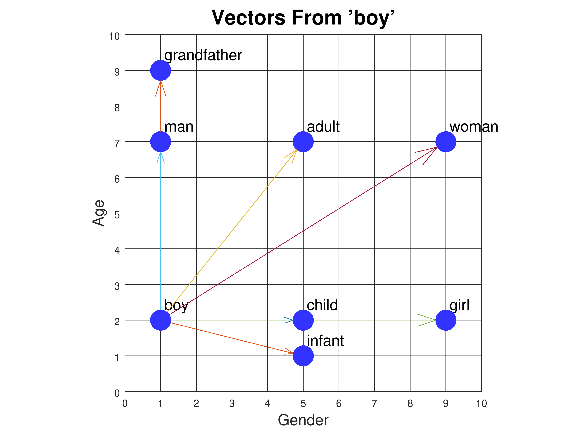

5. Pour créer ces *embeddings*, on se base sur le contexte
   et les statistiques des mots dans de grands corpus de textes (ex : Wikipédia).
   Le contexte d'un mot est défini comme les mots qui l'entourent dans une fenêtre donnée.

6. On calcule alors la **probabilité de cooccurrence**,
   c'est-à-dire la probabilité qu'un mot $c$ figure dans le contexte du mot $w$ : $P(c|w)$. Plus
   des mots apparaissent ensemble, plus leur probabilité de cooccurrence est
   élevée.

7. Ces statistiques donnent des matrices de haute dimension
   pour chaque contexte particulier. Pour réduire ces dimensions, on utilise
   la **décomposition en valeurs singulières** (SVD), ce qui
   donne un très bon résumé de l'information dans les matrices (tableaux de données).

8. Une fois la représentation vectorielle des mots obtenue,
   on peut entraîner des modèles de langage neuronaux. On leur apprend
   à prédire un mot en fonction des $n$ mots précédents :
   $P(w_t|w_{t-n+1}^{t-1})$ (avec $w_t$ le mot à prédire et
   $w_{t-n+1}^{t-1}$ les $n-1$ mots précédents).

9. On entraîne alors un réseau de neurones récurrent (comme
   un LSTM) en ajustant les poids du réseau pour maximiser la vraisemblance sur des ensembles de textes.

Ceci est une méthode efficace (elle atteint l'objectif) mais pas
efficiente (pas la meilleure manière possible). Le coût de calcul est
très élevé, cela nécessite de devoir stocker de grandes matrices, il y a une difficulté
avec les mots rares et pas d'apprentissage en ligne.

2013 : méthode **Word2vec**, c'est un modèle linéaire qui utilise
une astuce pour améliorer l'apprentissage des mots rares.

La méthode cooccurrence + SVD est une **méthode globale** qui observe
toutes les paires de mots, tandis que la méthode Word2vec est une **approche
locale** qui se concentre sur la prédiction d'un mot à partir de son contexte
immédiat (CBOW) ou du contexte à partir d'un mot central (Skip-gram), en utilisant
une fenêtre glissante sur le texte.

#### Des ConvNets aux Transformers

Les **réseaux de neurones convolutifs (ConvNets)** sont un type de réseaux
de neurones initialement développés pour la vision par ordinateur. Ils appliquent des filtres
de convolution pour extraire des caractéristiques locales à différentes échelles, comme
par exemple des **n-grammes**, qui sont des séquences de $n$ mots
permettant de détecter un motif spécifique (ex : expression idiomatique ou
structure syntaxique courante).

Les **réseaux récurrents (RNN)** sont également un type de
réseaux de neurones, mais conçus pour traiter des séquences (ex : texte).
Contrairement aux images, le langage est séquentiel. Les réseaux récurrents
permettent de mémoriser les informations passées et donc de modéliser
les dépendances à longue distance entre les mots de la phrase source
et la phrase cible.

Les **Long Short-Term Memory (LSTM)** sont un type de RNN qui utilise
des portes (gates) pour contrôler le flux d'information. Ils sont particulièrement efficaces
pour la traduction automatique, car ils peuvent mémoriser les informations
pertinentes de la phrase source tout en générant la phrase cible.

Le **mécanisme d'attention** est un mécanisme qui permet
de se concentrer sur différentes parties de la phrase source lors
de la génération. À chaque étape de décodage, le réseau calcule des poids
d'attention qui indiquent l'importance de chaque mot source. Ce mécanisme permet
un alignement flexible des mots source/cible.

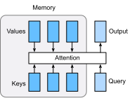

**Limites des LSTM et RNN :**

- Traitement séquentiel, plus lent que le parallélisme.
  Peu efficace sur GPU + temps d'apprentissage plus long que les ConvNets.
- Optimisation : explosion / disparition du gradient pendant l'apprentissage.

2017 : les **Transformers** sont une architecture de réseaux
qui se base entièrement sur le mécanisme d'attention, sans utiliser de RNN.
Ils utilisent des têtes d'attention multiples pour capturer différents types de relations entre
les mots et permettent un traitement parallèle des séquences $\implies$
plus efficace avec GPU et entraînement plus rapide. 6 couches d'attention.

Remplacent les LSTM dans Google Translate $\implies$ amélioration significative
des performances.

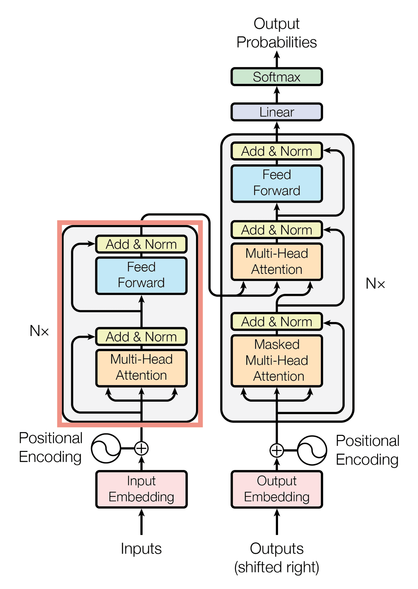

Il existe plusieurs modèles de langue basés sur les Transformers,
comme Mistral (32 couches d'attention) et ChatGPT (96 couches d'attention).

Cependant, malgré que les Transformers soient plus rapides,
ils sont gourmands en mémoire GPU. Très récemment, Google DeepMind
a présenté deux nouveaux modèles de langue basés sur des RNN (aussi efficaces et avec un débit plus rapide).

---

## Supervision et apprentissage automatique

L'IA contemporaine est un ensemble de dispositifs algorithmiques qui, pour atteindre des objectifs prédéfinis, se basent sur des énoncés mathématiques dérivés de l'apprentissage statistique (ML).

**Concepts clés** : entraînement, supervision, objectif, évaluation.

### Apprentissage supervisé

L'apprentissage supervisé est une méthode d'apprentissage automatique où le modèle apprend à partir d'exemples étiquetés (résultats attendus fournis par des experts), en ajustant ses paramètres pour minimiser l'erreur entre ses prédictions et les étiquettes.

Les **ensembles de données de vérité terrain** sont des ensembles de données où chaque exemple est associé à une étiquette, obtenues par des annotations manuelles effectuées par des experts. Ces ensembles de données servent de référence pour évaluer les performances des modèles. Ils sont ensuite divisés en deux sous-ensembles :

- **Les jeux d'entraînement**, qui sont la partie utilisée pour entraîner le modèle. C'est à partir de cela que le modèle apprend en ajustant ses paramètres pour minimiser l'erreur de ses prédictions.
- **Les jeux d'évaluation**, qui ne sont pas utilisés pendant l'entraînement. Ils servent à évaluer les performances du modèle sur de nouvelles données et à estimer sa capacité de généralisation. Ces étiquettes ne sont pas fournies pendant l'apprentissage mais sont utilisées après que le modèle ait fait ses prédictions, pour calculer des métriques de performance.

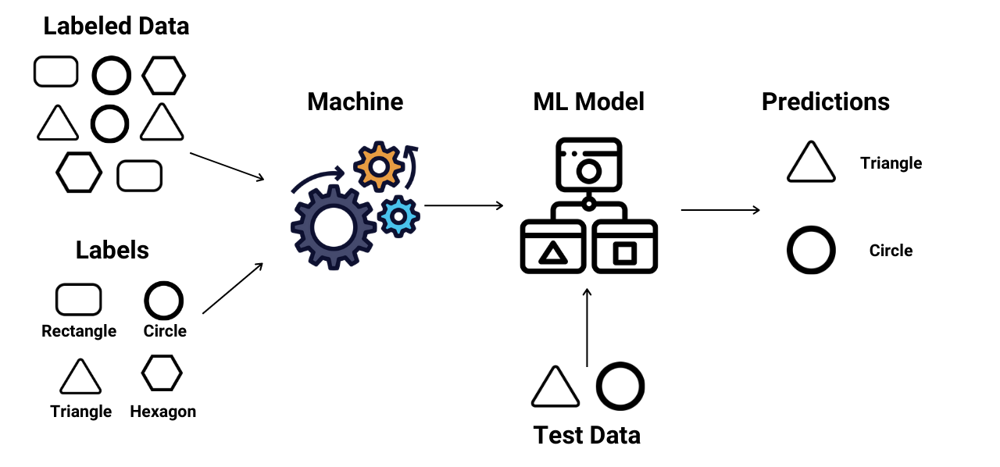

Cette méthode permet d'importantes avancées, atteignant parfois des performances meilleures que celles des humains et permettant le progrès dans certains domaines, mais présente aussi certaines limites :

- **Biais de sélection des données** : les données utilisées peuvent ne pas être représentatives de la diversité des situations réelles. Ainsi, les résultats du modèle peuvent être biaisés par ce manque de diversité.
- **Biais des annotations des données** : les annotateurs peuvent introduire des biais subjectifs qui peuvent se refléter dans les prédictions.
- **Coût de l'annotation**
- **Temps de l'annotation**

**Étapes du processus d'annotation :**

1. Définir l'objectif
2. Préparer les instructions
3. Recruter des experts
4. Former les annotateurs
5. Annoter les données
6. Examiner les annotations
7. Itération et affinement
8. Validation et finalisation

### L'apprentissage auto-supervisé

Dans ce cas, le modèle apprend des données d'entrée en réalisant des tâches prétextes qui ne nécessitent pas d'annotation manuelles. On essaye de permettre au modèle de découvrir des structures et des représentations utiles dans les données en réalisant des tâches prétextes.

**L'apprentissage discriminatif auto-supervisé** consiste à apprendre une fonction qui distingue les exemples positifs (similaires) des exemples négatifs (dissimilaires) sans étiquettes explicites.

**L'apprentissage contrastif** est une forme d'apprentissage discriminatif auto-supervisé qui repose sur la maximisation du contraste entre exemples positifs et négatifs. Il est entraîné à minimiser la distance entre les représentations positives et à maximiser la distance entre les exemples négatifs. Cela pousse le modèle à apprendre des représentations qui capturent les caractéristiques essentielles des données, indépendamment des variations non pertinentes.

**GPT (Generative Pre-trained Transformer)** est une architecture de modèles de langage développée par OpenAI. Les modèles GPT sont pré-entraînés de manière auto-supervisée sur de vastes corpus de textes, en apprenant à prédire le prochain mot dans une séquence. Ils apprennent ainsi des représentations linguistiques génériques et des connaissances générales sur le monde.

Un GPT peut ensuite être spécialisé (fine-tuné) pour des tâches spécifiques comme la complétion de texte, la traduction, le résumé, etc. en l'entraînant sur un petit jeu de données annoté pour la tâche visée.

L'architecture des GPT repose sur le Transformer, un réseau de neurones utilisant le mécanisme d'attention pour modéliser les dépendances entre les mots d'une séquence. Les Transformers ont révolutionné le traitement du langage naturel ces dernières années.

**Obtenir des paires d'images sans annotations** peut se faire par plusieurs techniques :

- Transformation d'une même image
- Frames successives d'une vidéo
- Vues différentes d'un même objet / scène
- Correspondances multimodales

Le **modèle CLIP** (Contrastive Language-Image Pre-training), développé par OpenAI, apprend à associer des images et des descriptions textuelles, avec plus de 400 millions de paires collectées sur Internet. Il offre des performances équivalentes à l'apprentissage supervisé (comme sur ImageNet), avec de meilleures capacités de généralisation face aux données inconnues.

D'autres modèles, développés par différentes entreprises, émergent également.

### Apprentissage par instruction

C'est une approche prometteuse pour entraîner des modèles de langage à effectuer des tâches spécifiques en suivant des instructions en langage naturel. Cela permet d'adapter des modèles pré-entraînés de manière auto-supervisée à de nouvelles tâches sans avoir besoin de grands jeux de données.

Le principe est d'alimenter le modèle avec des exemples d'instruction et les sorties attendues, le modèle apprend ainsi à suivre des directives pour générer des réponses appropriées.

Ces modèles ont réalisé des progrès spectaculaires mais présentent encore certaines limites :

- Manque de connaissances du monde réel, étant donné qu'ils ne sont entraînés que sur du texte, ils n'ont pas de compréhension profonde de concepts abstraits, de relations, etc., leurs générations sont cohérentes mais pas toujours factuelles ou logiques.
- Difficulté à effectuer des tâches spécifiques.
- Tendance à halluciner
- Biais et toxicité, dus aux données d'entraînement.
- Manque d'interprétabilité, il est difficile d'analyser le raisonnement interne des modèles et d'expliquer leurs prédictions.

**L'alignement** des modèles de fondation est le fait de s'assurer que les modèles se comportent de manière alignée avec les intentions, les valeurs et les préférences humaines.

Plusieurs approches complémentaires existent pour aligner ces modèles :

- **Alignement avec les attentes des utilisateurs :** on peut affiner le modèle sur un ensemble de requêtes d'utilisateurs et les réponses idéales correspondantes, ce qui permet d'ajuster le modèle aux préférences souhaitées.
- **Instructions auto-générées :** le modèle peut être entraîné à suivre ses propres instructions, générées à partir de motifs décrivant la tâche.
- **Alignement sur un domaine spécialisé :** on aligne le modèle sur le domaine spécifique dont il est question en l'affinant sur un corpus du domaine et les connaissances propres à celui-ci.
- **Alignement avec les valeurs humaines** (technique avancée), passe par des techniques comme l'apprentissage par renforcement à partir de retour humain (RLHF) où le modèle est récompensé quand son retour est jugé "aligné".

L'alignement fait face à des limites et des défis nombreux :

- Les valeurs humaines sont subjectives et parfois contradictoires.
- Mesurer l'alignement est complexe.
- Un comportement aligné ne se généralise pas nécessairement bien.
- Un alignement mal calibré conduit facilement à des comportements indésirables.
- Un sur-alignement peut rendre le modèle moins performant.

---

## IA générative et sphère informationnelle

### Générateur d'images par IA

On distingue deux grandes familles de modèles : génératifs et discriminatifs.

#### IA discriminative

Les modèles discriminatifs cherchent à apprendre une fonction qui
mappe une entrée à une sortie. Ils sont utilisés pour des tâches
de classification, détection, segmentation... Les architectures courantes
sont : CNN (réseaux de neurones convolutifs) et les transformers.

L'apprentissage de ces modèles se fait de manière supervisée.

Exemples : ResNet, YOLO, Mask R-CNN.

#### IA générative

Les modèles génératifs cherchent à apprendre la distribution de
probabilité sous-jacente aux données d'entraînement.
Ils génèrent de nouvelles images similaires aux jeux d'entrée.
Architectures courantes : GAN (réseaux antagonistes génératifs),
auto-encodeurs variationnels (VAE) et modèles de diffusion.

L'apprentissage des modèles génératifs se fait de manière non supervisée.

Exemples : Dall-E, Midjourney.

Les différents modèles pour la génération d'images :

- **Auto-encodeurs (AE) :** ils transforment l'image en une
  représentation latente compacte, et un décodeur reconstruit
  l'image par rapport à cette représentation. L'objectif est de minimiser
  l'erreur de reconstruction. Ils permettent de compresser des images et apprennent de manière auto-supervisée,
  mais la qualité des images générées est mauvaise et il y a un manque de contrôle sur la génération.
- **Auto-encodeurs variationnels (VAE) :** ils étendent les AE
  en ajoutant une contrainte sur la distribution de l'espace latent.
  L'encodeur génère les paramètres de moyenne et variance d'une distribution normale multivariée,
  à partir de laquelle on échantillonne le code latent. Le décodeur reconstruit
  alors l'image à partir de ce code.
  Ils minimisent également l'erreur de reconstruction, mais les images générées restent
  de qualité non supérieure.
- **Modèles de diffusion :** ils apprennent un processus de destruction
  d'images bruité, puis inversent ce processus pour générer de
  nouvelles images. Ils génèrent l'image en plusieurs étapes.

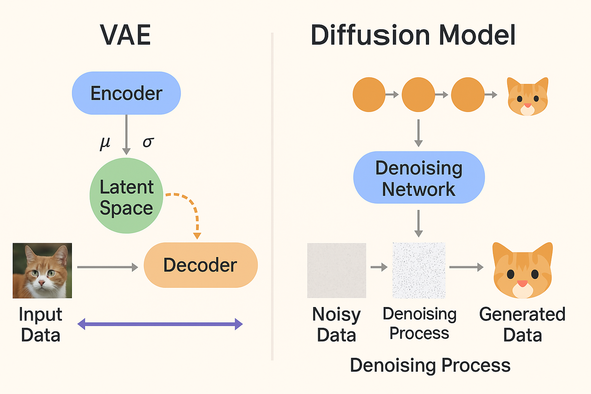

Une **chaîne de Markov** est un modèle stochastique décrivant
une séquence d'événements possibles, chacun associé à une probabilité qui ne dépend
que de l'état de l'événement précédent.

**Forward Diffusion :** Elle consiste à ajouter progressivement
du bruit gaussien à une image d'entraînement $(x_0)$ selon une chaîne de Markov.
On obtient ainsi une séquence d'images de plus en plus bruitées
$(x_1 \ldots x_T)$ avec $T$ le nombre d'étapes de diffusion. Le niveau
de bruit ajouté à chaque étape est contrôlé par un paramètre de variance
qui augmente. Le modèle apprend à estimer le bruit qui
a été ajouté à l'image.

**Reverse Diffusion :** Une fois entraîné, le modèle
peut être utilisé pour générer une nouvelle image en inversant
le processus de *forward diffusion*. On part d'une
image bruitée et on applique itérativement le
modèle pour enlever le bruit et obtenir une image nette.

Ces processus sont stochastiques.

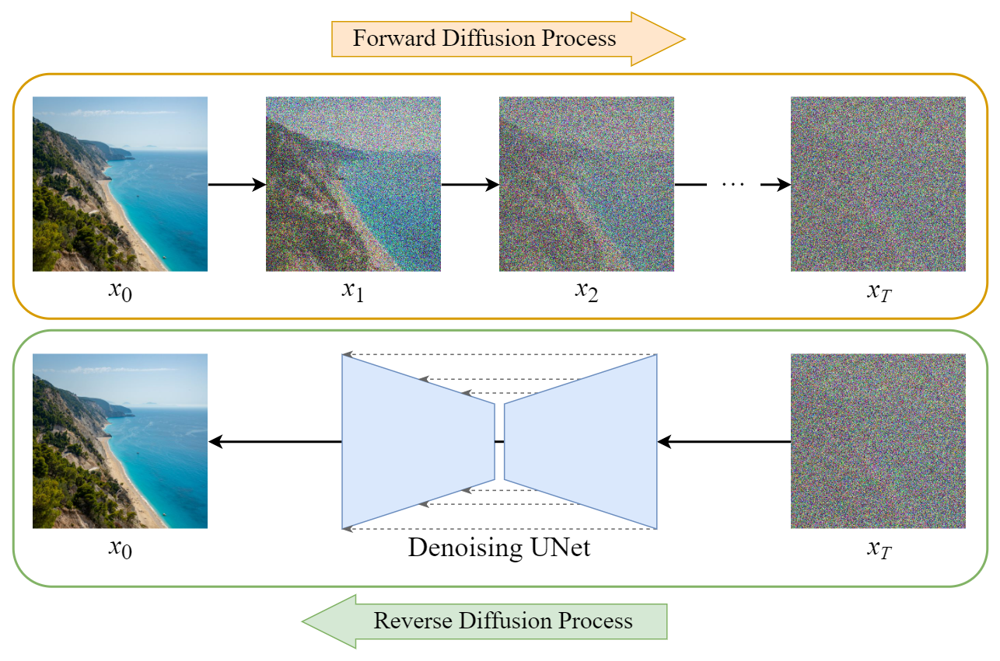

#### Conditionner la génération d'images

**Avec un modèle de fondation :** On peut conditionner la génération avec les embeddings
d'un modèle de fondation pré-entraîné. L'embedding du texte est
concaténé à l'image bruitée à chaque étape, ce qui permet de guider
la génération.

**Disposition des objets :** Pour contrôler la disposition
des objets dans les images générées, on fournit au modèle un masque
spatial indiquant où placer chaque objet.

**Suppression d'objets :** Pour supprimer un objet d'une image,
on utilise un modèle de diffusion entraîné à "inpainter" des régions masquées.
On fournit l'objet masqué et il génère une nouvelle version avec l'objet
remplacé par un contenu plausible selon le contexte.

### Fausses images et sphère informationnelle

Les conséquences de la circulation de fausses images ne sont pas encore majeures mais créent
des inquiétudes car elles mettent à mal les deux protocoles traditionnels
de vérification des images (recherche inversée, analyse des retouches).
Il y a une inquiétude (David Colon) quant à la guerre mondiale informationnelle.

**Guerre du Golfe :**
L'Irak envahit le Koweït. Un cabinet d'avocats engagé par des fonds koweïtiens
mobilise l'opinion publique américaine contre l'Irak.
Une campagne médiatique énorme est lancée avec le témoignage de Nahira,
qui était en fait faux, car c'était la fille d'un ambassadeur.
Les États-Unis prennent la tête de la coalition contre l'Irak. C'est une guerre hautement médiatique
mais les reportages sont très cadrés et contrôlés par le Pentagone. Elle aboutit finalement
au triomphe du récit américain. Après la guerre, il y a l'émergence d'une "domination
informationnelle".

Réactions : l'Iran (IRIB, budget pour des chaînes diffusées en français, anglais, espagnol), le Qatar
(Al Jazeera, canal utilisé par le Hamas, Al-Qaïda...), la Chine (Bouclier
doré et grand pare-feu, écosystème numérique national
BATHX), la Russie (SORM intercepte les communications, médias russes,
déstabilisation informationnelle, ex : campagnes électorales,
grande vague de fausses informations).

Cela résulte en un chaos informationnel.

Exemple : attaque d'un hôpital à Gaza.

En somme, si les conséquences de la circulation de fausses images
n'ont pas encore été lourdes, celles-ci fragilisent davantage un environnement
médiatique déjà rempli de fausses informations.
